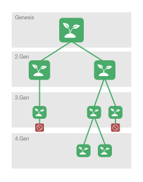

# Mana.Link

**Table of Contents**
- [Konzept](#konzept)
  - [Was ist Mana Link?](#was-ist-mana-link?)
  - [Auswirkung](#auswirkung)
  - [Namen](#namen)
  - [Domain](#domain)
  - [User Story](#User-Story)
  - [Prozessablauf](#Prozessablauf)
  - [Finanz-Ökosystem](#Finanz-Ökosystem)
- [Development](#Developing)
  - [Hosting](#hosting)
  - [Technologien](#technologien)

## Konzept

### 📖 Was ist Mana Link?
Mana.Link ist die Dokumentation der Vermehrung und Verteilung von Pflanzen zur nachträglichen Verfolgung des Bestandes und derer Entwicklung.

### 🪡 Auswirkung
Eine erhofte Auswirkung ist die Dokumentation der vegetanischen Vielfalt. 
Durch diese lassen sich der Bestand und die Weiterentwicklung der Plfanze messen.

### 🏷️ Namen
Der Name Mana.Link besteht aus folgenden zwei Begriffen:

**Mana**
Mana ist das sich verselbständigende, ein genau definiertes Verhalten auslösendes Stigma (eines Lebewesens, eines Objekts, eines Zustandes)

**Link**
Ein Link bezeichnet in der Kommunikationstechnik, insbesondere bei Netzwerken, im Allgemeinen eine Verbindung zweier Komponenten.

### 🌐 Domain
- [mana.link](https://mana.link)

### 🤌 User Story
Ich gehe in den Laden "Mana Shop" und kaufe mir dort eine Pflanze. Diese Pflanze stelle ich in meine Wohnung und pflege diese sehr gut. Der Plfanze geht es so gut, dass sie sich vermehrt.
Sie bekommt Setzlinge. Diese Setzlinge nehmen Platz im Topf weg und müssen somit raus und im besten Fall werden diese verschenkt und leben weiter in der nächsten Generation.

### ⚙️ Prozessablauf
Der Genesis-QR-Code öffnet eine Webseite (mana.link/{QR-Code ID} auf der die Plfanze mit Ihrer Geschichte präsentiert wird. 
Dort zu sehen und nur durch den QR-Code berechtigt, erscheint ein Formular, indem man seine persönlichen Daten einträgt und sich somit mit dieser Pflanzer vekrnüpft. 
Nach Abschluss erhält man die Möglichkeit, weitere QR-Codes der 2. Generation zu erzeugen, da die Pflanze Setzlinge bildete, die man umtopfen kann und somit an andere weiterverschenkt. 
Bevor man die Pflanze verschenkt, legt man dem Setzling den QR-Code der 2. Generation bei, sodass sich der Beschenkende der Pflanze, sich auf der URL des neuen Codes wiederum auf mana.link mit dieser Generation als Besitzer verknüpft.
Somit generiert sich nach Weilen eine Verankerungskette, die den Weg der Pflanze durch die Menscheit und der Epochen verknüpft.



Durch diesen Prozess kann man in Zukunft herausfinden, wer hatte alles diese Pflanze, woher kam sie. Es könnte passieren, dass ich meine Pflanze verschenke und diese irgendwann als Geschenk bei einer bekannten Person landet. Bspw. Angelar Merkel.

### 💰 Finanz-Ökosystem
Man kauft sich mit der Währung Mana.Link im Laden "Mana Shop", die Pflanze . Durch die Bezahlung in ManaL darf der Käuft sich auf mana.link für den Genesis Block registrieren.

Jeder neue Eintrag eines Setzlings der weiteren Generationen darf nur durch den Tausch von Mana.Link sein Besitzestum in der Chain eintragen und somit Teil der Kette werden.

Sobald die eigene Pflanze stirbt wird man mit dem Verkauf seines Mana.Link Token belohnt. 

Dieser Kette ist die Auszahlung der anteiligen Berührungen beim erzeugen und erhalt des Netzwerkes (Chain). Somit verkauft man seine Token und aktualisiert den allgemeinen Bestand.

## ⌨️ Developing

### Hosting
Die Webseite wird über das IPFS auf der Domain mana.link ausgeliefert. IPFS ist das dezentrale Speicher-Netzwerk. Beim export der Webseite wird durch den Service https://pinata.cloud/ mittels API Key die gerenderte Webseite ins IPFS gespeichert.

### Technologien
- [IPFS Hosting](https://pinata.cloud/)
- [NextJS](https://nextjs.org/)
- [ReactJS](https://reactjs.org/)
- StyledComponents
- [Polkadot{js}](https://polkadot.js.org/) zum verknüpfen des Wallets
- [Substrate](https://substrate.dev/) zum erzeugen der eigenen Blockchain auf basis von Polkadot

### Deployment
Das Repository wird durch eine Pipeline in GitLab deployed. Nachdem NextJS exportiert wurde, wird der `out` Ordner mittels folgendem Code auf dem IPFS deployed

```jsx
const sourcePath = `${__dirname}/web/out`;
const options = {
    pinataMetadata: {
        name: 'Mana.Link',
        keyvalues: {
            customKey: 'customValue',
            customKey2: 'customValue2'
        }
    },
    pinataOptions: {
        cidVersion: 0
    }
};

const result = await pinata.pinFromFS(sourcePath, options)
```

### Pflanzenerkennung per AI
Beim scannen der Pflanze, zum verknüpfen des Besitzers, verwenden wir eine AI zum identifizieren der Pflanze. 
- Service: https://web.plant.id/plant-identification-api/

### Foto Upload
Fotos von den Pflanzen werden im IPFS abgespeichert und erhalten eine CID zur Wiedererkennung.

### Transaktion
im folgenden Code ist der logische Ablauf einer Transaktion beschrieben.

```jsx

const previousTransactionBlock = Polkadot.getTransactionBlockFromHash(hash)

// User
const senderWallet = previousTransactionBlock.getRecieverAdress()
const recieverWallet = LocalWallet.getRecieverWalletAdress()

// Object
const picture = getPictureFromCamera()

// ObjectData
const pictureCID = uploadPictureToIPFS(picture)
const aiResult = recognitePlantFromAI(picture)

const manaCost = 5;

// Abort on insufficient balance
const recieverBalance(recieverWallet.getBalance() < manaCost) {
  new Error('insuffiecent balance')
}

// build new Transaction
const Transaktion = new Polkadot.newTransaction()

Transaktion.setSender(senderWallet.getAdress())
Transaktion.setReciever(senderWallet.getAdress())
Transaktion.setManaAmount(manaCost)

Transaktion.setObject({
  type: 'plant',
  name: aiResult.name,
  picture: pictureCID
})

Transaktion.execute()

```

### Transaktions Block Beispiel
```jsx

const Block = {
  owners: {
    sender: senderWallet.getAdress(),
    reciever: recieverWallet.getAdress()
  },
  object: {
    type: 'plant',
    name: aiResult.name,
    picture: pictureCID
  }
}
```

## Licence
```
This is free and unencumbered software released into the public domain.

Anyone is free to copy, modify, publish, use, compile, sell, or
distribute this software, either in source code form or as a compiled
binary, for any purpose, commercial or non-commercial, and by any
means.

In jurisdictions that recognize copyright laws, the author or authors
of this software dedicate any and all copyright interest in the
software to the public domain. We make this dedication for the benefit
of the public at large and to the detriment of our heirs and
successors. We intend this dedication to be an overt act of
relinquishment in perpetuity of all present and future rights to this
software under copyright law.

THE SOFTWARE IS PROVIDED "AS IS", WITHOUT WARRANTY OF ANY KIND,
EXPRESS OR IMPLIED, INCLUDING BUT NOT LIMITED TO THE WARRANTIES OF
MERCHANTABILITY, FITNESS FOR A PARTICULAR PURPOSE AND NONINFRINGEMENT.
IN NO EVENT SHALL THE AUTHORS BE LIABLE FOR ANY CLAIM, DAMAGES OR
OTHER LIABILITY, WHETHER IN AN ACTION OF CONTRACT, TORT OR OTHERWISE,
ARISING FROM, OUT OF OR IN CONNECTION WITH THE SOFTWARE OR THE USE OR
OTHER DEALINGS IN THE SOFTWARE.

For more information, please refer to <http://unlicense.org/>
```


*archiv*
Dieses System erzeugt eine finanzielle Einbahnstraße und erzeugt einen Pot für eine Wertigkeit


Bei Tod der Pflanz, darf man seinen Token, der jeweiligen Generation auszahlen lassen und erhält, anteilig an den, nach mir erzeugten Pflanzen 

Die Pflanze ist der Token, also der Wert. Die Schenkung des Setzlinges an weitere Personen, die Transaktion des Wertes.
Je älter der Token, umso höher die verschenkten Generationen wodurch der Wert des Genesis Token der Pflanze sich erhöht.
